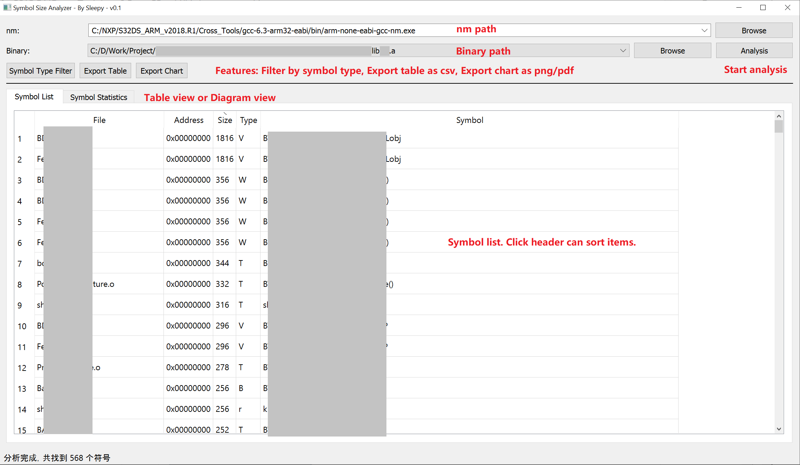

# SymbolSizeAnalyzer

-----------------------

## **CN**

## 起因

由于工作中需要对lib的大小进行优化，于是我在AI的帮助下写了一个简单的程序分析符号的大小，以确定优化点。

后来为了方便使用，又花了一点时间在AI的帮助下给它增加界面、优化显示、增加分类过滤和数据导出的功能。
并记录nm和binary等使用的文件文件历史，以便每次启动后就能一键开始分析。

不得不说，效果还挺好。而且该程序是基于nm输出的结果，理论上可以支持所有----至少是gcc toolchain----编译出来的binary。
如果其它toolchain有类似nm的工具，也可以一试。


## 声明

该程序主要代码由AI编写，我进行重构和细节调整，大家可以随意使用和修改。

由于代码调整过程经过多轮AI调教，所以程序中注释和提示文本中英文夹杂。

同理，最初该程序仅有前面几个函数，界面和类是后加的。 

对于这些混杂的风格，请多包涵（毕竟活多时间有限）。


## 使用

```sh
pip install -r requirements.txt         # 安装依赖
python SymbolSizeAnalyzer.py            # 运行主程序
```



Chart View图表展示内容如下：

+ 按文件统计大小
+ 按符号统计大小
+ 按符号类型统计大小

注意：符号字母标记对应的解释可以打开“Symbol Type Filter”查看。

-----------------------

## **EN**

## Cause

Because the size of lib needs to be optimized at work, I wrote a simple program with the help of AI to analyze the size of symbols to determine the optimization points.

Later, for ease of use, I spent some time with the help of AI to add interface, optimize display, add classification filtering and data export functions.
And record the file history of nm and binary, so that you can start the analysis with one click every time you start.

I have to say that the effect is quite good. Moreover, this program is based on the output of nm, and theoretically can support all binaries compiled by gcc toolchain at least.

If other toolchains have tools similar to nm, you can also try it.

## Statement

The main code of this program is written by AI, and I refactored and adjusted the details. You can use and modify it at will.

Because the code adjustment process has undergone multiple rounds of AI adjustment, the comments and prompt texts in the program are mixed with English.

Similarly, the program originally only had the first few functions, and the interface and class were added later.

Please forgive these mixed styles (after all, life is limited).

## Usage

```sh
pip install -r requirements.txt     # Install dependencies
python SymbolSizeAnalyzer.py        # Run the main program
```


The Chart View chart displays the following:

+ Size by file
+ Size by symbol
+ Size by symbol type

Note: The explanation of the symbol letter mark can be viewed by opening the "Symbol Type Filter".
